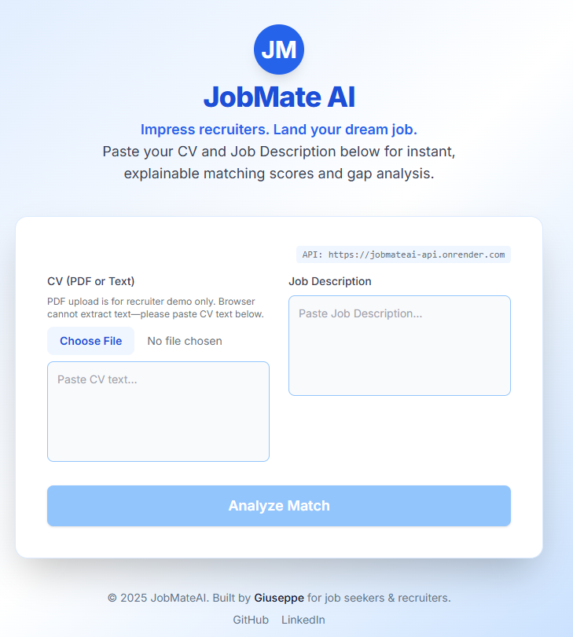

 

# JobMateAI

[](https://github.com/Giuseppe552/jobmateAI/actions/workflows/ci.yml)
[](https://render.com/)
[](https://vercel.com/)
[](LICENSE)
[](https://www.python.org/)
[](https://nextjs.org/)
[](https://fastapi.tiangolo.com/)

---

👉 **Live Demo:**  
- Frontend: [jobmate-ai.vercel.app](https://jobmate-ai-six.vercel.app/)
- Backend: [jobmateai-api.onrender.com/health](https://jobmateai-api.onrender.com/health)


> **JobMateAI** is a modern, explainable AI platform for matching CVs to job descriptions, built for recruiters and candidates. Designed for speed, transparency, and demo simplicity—no databases, no paid APIs, no authentication.

---

## 🏁 Quickstart
 
### Backend (FastAPI)
```bash
git clone https://github.com/Giuseppe552/jobmateAI.git
cd jobmateAI/backend
pip install -r requirements.txt
pytest -q
uvicorn app.main:api --reload
# Visit: http://127.0.0.1:8000/health
```

### Frontend (Next.js)
```bash
cd ../frontend
npm install
# Set API URL in .env.local
echo NEXT_PUBLIC_API_URL=[your Render backend URL] > .env.local
npm run dev
# Visit: http://localhost:3000
```

---

## 🧠 Features

- **Explainable Scoring:** Cosine similarity, TF-IDF n-gram matches, and gap analysis.
- **Embeddings Cache:** Fast, file-based, using MiniLM-L6-v2.
- **PDF/Text Parsing:** Robust extraction and normalization.
- **Deterministic Rewrite:** STAR/CAR bullet suggestions, no external APIs.
- **Rate Limiting:** Demo-safe, per-IP.
- **Modern UI:** Next.js + Tailwind, instant feedback.

---

## 📦 API Examples

**POST /score**
```json
{
  "cv_text": "Python developer with AWS experience",
  "jd_text": "Looking for Python and AWS skills"
}
```
Response:
```json
{
  "score": 0.87,
  "matches": ["python", "aws"],
  "gaps": ["cloud"],
  "weights": {"skills":0.5,"responsibilities":0.3,"tools":0.2}
}
```

**POST /rewrite**
```json
{
  "cv_text": "...",
  "jd_text": "..."
}
```
Response:
```json
{
  "bullets": ["Situation: ...", "Task: ...", ...]
}
```

---

## 📸 Screenshots

*Add screenshots here to showcase the UI and API responses.*

---

## 🛠️ Deployment

- **Backend:** Render (auto-detects `render.yaml` at repo root)
- **Frontend:** Vercel (set `NEXT_PUBLIC_API_URL` to backend URL)

---

## ❌ Non-Goals

- No databases
- No paid LLMs/APIs
- No authentication (demo only)

---

## 📬 Contact

For questions, feedback, or collaboration, reach out via [GitHub Issues](https://github.com/Giuseppe552/jobmateAI/issues).

Or email: contact.giuseppe00@gmail.com
